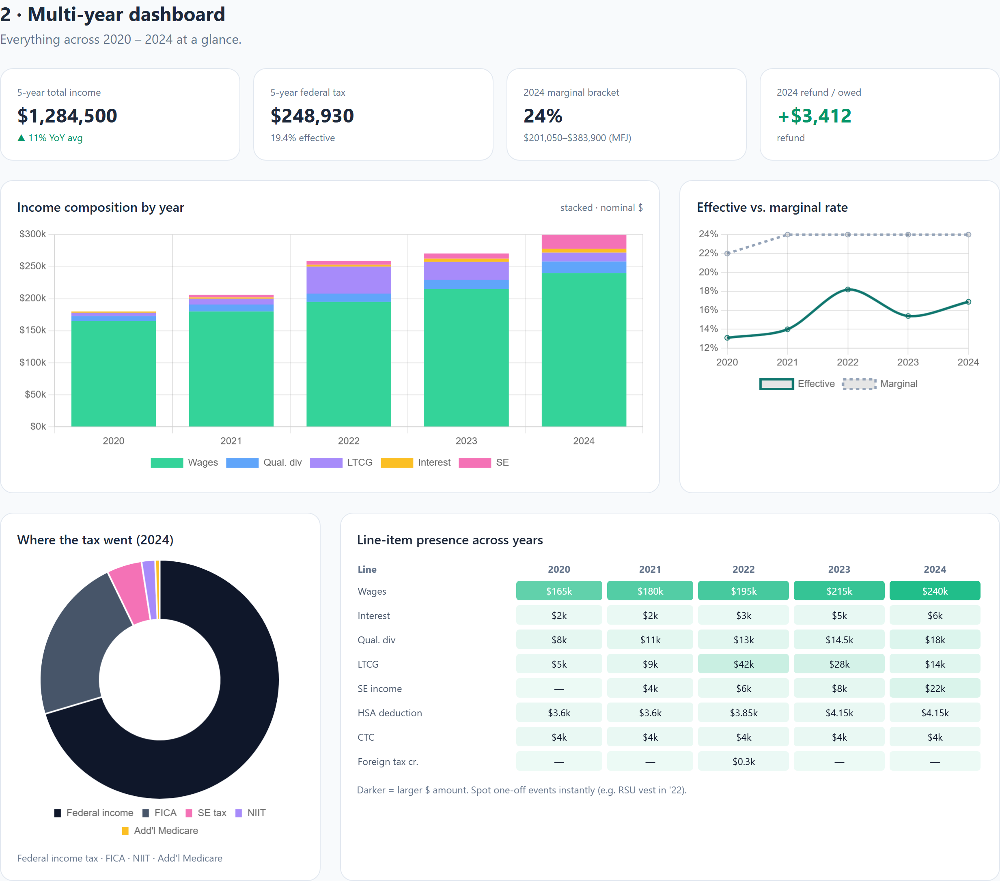
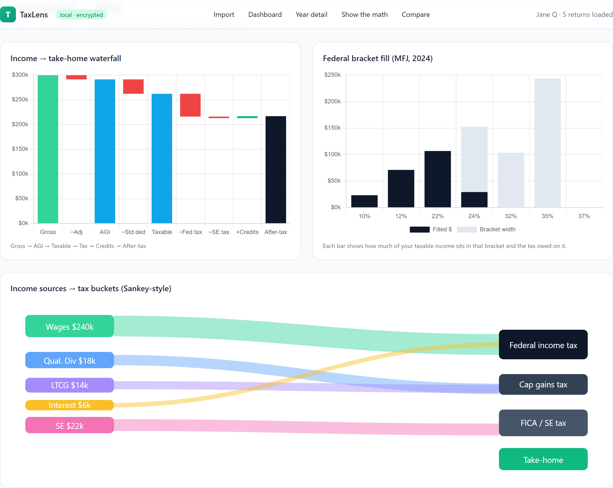
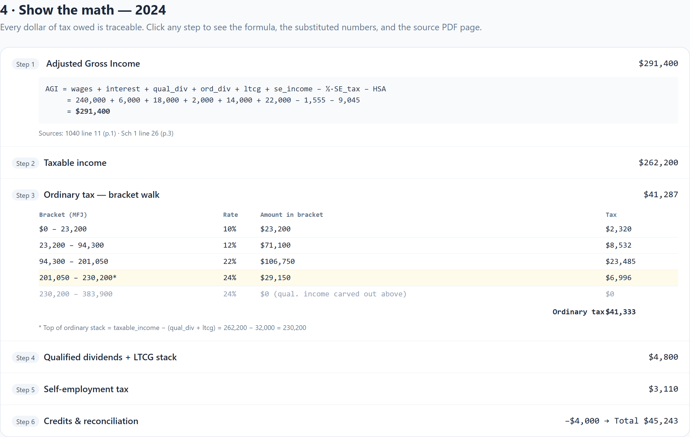
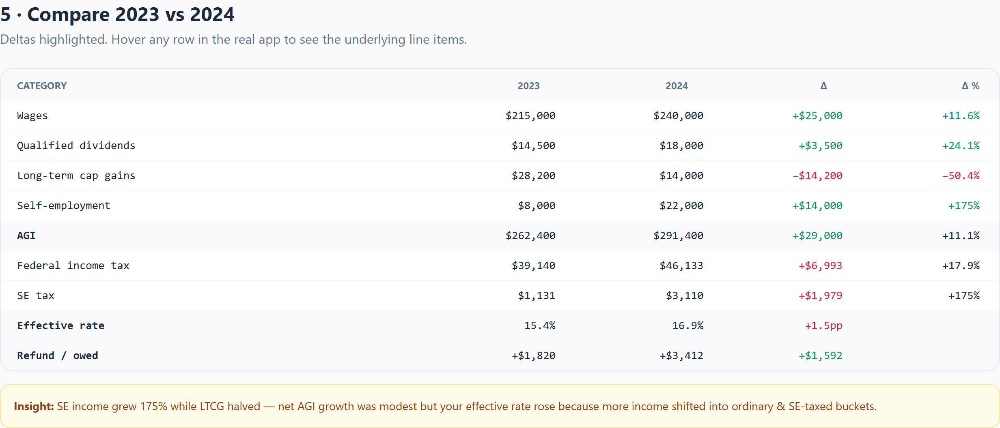
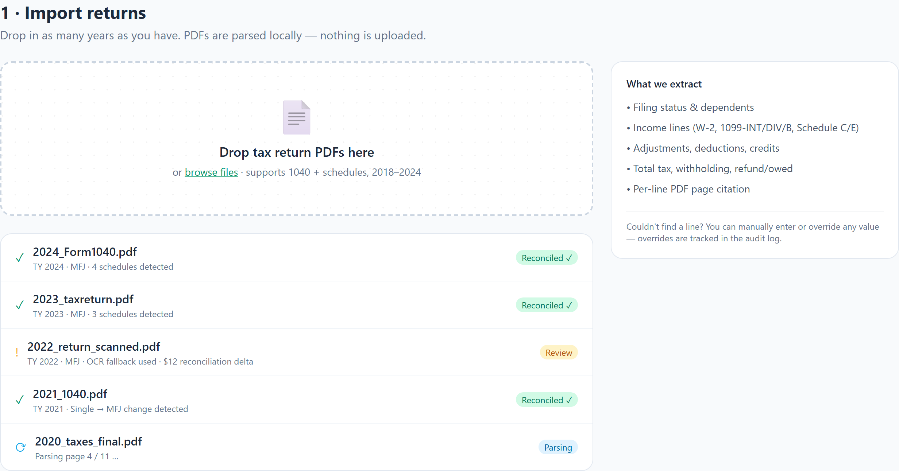

# TaxLens

A local-first tool that ingests US tax return PDFs (Form 1040 + common schedules), extracts income and tax line items, recomputes the tax math transparently, and visualizes trends across years.

- **Transparent math** — every dollar of tax traceable to a formula and its inputs
- **Multi-year** — drop in any number of years; see trends instantly
- **Privacy-first** — PDFs parsed locally; nothing leaves your machine

## Screenshots

Renders below are from [`docs/mockups.html`](docs/mockups.html). Regenerate any time with `python scripts/capture_mockups.py`.

### Dashboard — multi-year overview


### Year detail — income waterfall + bracket fill


### Show the math — audit trail with PDF citations


### Compare — any two years side by side


### Import — drag-drop multiple PDFs at once


## Repo layout

```
taxlens/
├── src/taxlens/             # Python tax engine (pure functions, decimal arithmetic)
│   └── tax_rules/federal/   # Year-versioned bracket/credit YAML — change rules without touching code
├── tests/                   # Engine tests + golden return fixtures
└── pyproject.toml
```

## Status

- [x] Phase 1 — Engine + 2023/2024 federal rules + reconciliation tests
- [x] Phase 2 — Import pipeline (PDF via pdfplumber, TXF, JSON/YAML manual)
- [x] Phase 3 — SQLite persistence, FastAPI sidecar, single-page web UI
- [x] Phase 4 — Multi-year dashboard, year detail, math view, what-if editor, compare view
- [x] Phase 5 (v0.2) — AMT (Form 6251), Schedule D 28%/25% worksheet, CA state module, at-rest DB encryption (Fernet), Electron desktop shell
- [x] v0.3 — Schedule E + K-1 + §199A QBI + ISO/AMT, CA Mental Health Services Tax, **Tax Savings Advisor** (single-year + cross-year rules), NY/IL/TX/FL/WA state stubs, broker 1099-B CSV importer, OCR fallback (Tesseract), demo mode, PyInstaller-bundled desktop backend, signing/notarization docs
- [x] v0.4 — **Cross-OS installers via GitHub Actions** (Win `.exe` + macOS `.dmg` + Linux `.AppImage`), Roth conversion + Tax-loss harvest simulators, WA 7% capital-gains tax (RCW 82.87), 2023 state-YAML backfills, §1211(b) capital-loss limit in engine
- [x] v0.5 — Multi-year capital-loss carryforward, NYC + Yonkers locality tax, MA/OR/NJ/VA/GA state YAMLs, Trends tab (SVG line/stacked charts), SHA-256 checksums + signed build provenance on every release

See `src/taxlens/tax_rules/federal/` for the rule tables and `tests/fixtures/returns/` for golden returns.

## Download (no Python required)

Pre-built installers are attached to each [release](https://github.com/richardpan/taxlens/releases):

| OS      | File                              |
|---------|-----------------------------------|
| Windows | `TaxLens-Setup-x.y.z.exe` (NSIS)  |
| macOS   | `TaxLens-x.y.z.dmg` (Apple Silicon, ad-hoc signed) |
| Linux   | `TaxLens-x.y.z.AppImage`          |

### Verifying your download (free, no accounts)

Every installer is published alongside two trust artifacts produced by
GitHub's runners — both **free**, both verifiable on your own machine:

1. **`*.sha256` file** — a SHA-256 checksum of the installer.
   ```bash
   # macOS / Linux
   shasum -a 256 -c TaxLens-0.5.0.dmg.sha256
   # Windows (PowerShell)
   Get-FileHash TaxLens-Setup-0.5.0.exe -Algorithm SHA256
   ```

2. **GitHub build-provenance attestation** — cryptographic proof that this
   exact binary was built from this exact commit by GitHub's CI, signed by
   Sigstore. Requires the [`gh` CLI](https://cli.github.com/):
   ```bash
   gh attestation verify TaxLens-Setup-0.5.0.exe --repo richardpan/taxlens
   ```

### Why are the installers unsigned?

TaxLens is a free, hobbyist project. Mainstream code-signing certs (EV for
Windows, Apple Developer ID for macOS) cost ~$100–$300/year and require
shipping cryptographic hardware. We've chosen not to pass that cost on to
users or maintainers. Instead we publish the checksums + build provenance
above so you can verify the binary came from this repo's CI.

#### First-launch warnings — how to bypass

- **Windows SmartScreen** ("Windows protected your PC"):
  Click **More info** → **Run anyway**.
- **macOS Gatekeeper** ("TaxLens cannot be opened"):
  Right-click the app in Finder → **Open** → confirm. (Subsequent launches
  are silent.) On Apple Silicon, our ad-hoc signature prevents the
  "TaxLens is damaged" error you'd see with no signature at all.
- **Linux AppImage**: `chmod +x TaxLens-0.5.0.AppImage && ./TaxLens-0.5.0.AppImage`.
  No warnings on most distros.

If you'd rather not deal with any of this, the **run-from-source path**
below has zero installer warnings.

## Quick start (developer)

```powershell
cd taxlens
python -m venv .venv
.\.venv\Scripts\Activate.ps1
pip install -e ".[dev]"
pytest                              # 78 tests, ~10s
taxlens import path\to\1040.pdf     # also accepts .txf / .json / .yaml / .csv (1099-B)
taxlens list
taxlens serve                       # opens http://127.0.0.1:8765 in your browser
taxlens lock                        # encrypt local DB with a passphrase
taxlens unlock                      # decrypt; serve auto-prompts if locked
```

### Desktop (Electron) shell

```powershell
cd desktop
npm install
npm start                           # spawns the sidecar + opens a native window
```
See `desktop/README.md`.

The web UI has six screens: Import (drag-drop), Dashboard (multi-year), Year detail (waterfall + bracket fill), Show the math (audit trail), What-if editor (live recompute), Compare.

## Architecture

```
┌────────────────────────┐     ┌──────────────────────┐     ┌──────────────────────┐
│  Browser (vanilla JS + │ ◀──▶│  FastAPI sidecar     │ ◀──▶│  SQLite (encrypted   │
│  Tailwind + Chart.js)  │     │  taxlens.api         │     │  in Phase 5)         │
└────────────────────────┘     │                      │     │  - returns           │
                               │  ┌─────────────────┐ │     │  - computation_cache │
                               │  │ service layer   │ │     │  - overrides         │
                               │  └─────────────────┘ │     └──────────────────────┘
                               │  ┌─────────────────┐ │
                               │  │ importers       │◀──── PDF / TXF / JSON / YAML
                               │  │  pdf, txf, …    │ │
                               │  └─────────────────┘ │
                               │  ┌─────────────────┐ │
                               │  │ engine (pure)   │◀──── tax_rules/federal/*.yaml
                               │  │  Decimal math   │ │
                               │  └─────────────────┘ │
                               └──────────────────────┘
```

## Design principles

1. **Engine is pure.** No I/O, no globals, no floats — `Decimal` everywhere money is involved.
2. **Rules live in YAML**, never in code. A new tax year is a one-file PR.
3. **Every computation step is recorded** as `(label, formula, inputs, output)` so the UI can render an audit trail and cite back to the source PDF.
4. **Never silently "fix" a return.** Surface deltas; let the user decide.
5. **Idempotent imports.** Re-importing the same file (matched by sha256) replaces, never duplicates.

## Adding a new tax year

1. Drop a new file `src/taxlens/tax_rules/federal/{YEAR}.yaml` with brackets, std deduction, FICA caps, NIIT/Add'l Medicare thresholds, CTC params. Use 2024 as a template.
2. Add a golden return YAML in `tests/fixtures/returns/`.
3. Run `pytest` — engine snapshot tests must match within $0.01.

## License

MIT (see LICENSE).
